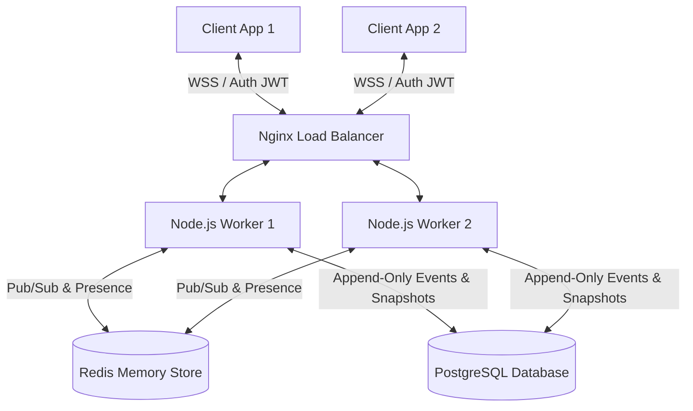

# Real-Time Collaborative Sync Engine

A production-grade, Google Docs-style collaborative editing backend built **from first principles** using the **RGA (Replicated Growable Array) CRDT** algorithm. This project implements a fully decentralized conflict-resolution system without depending on any pre-built sync libraries.

---

## 💡 The Problem It Solves

When multiple users edit a shared document concurrently (like Google Docs or Notion), their edits can conflict. For example, if User A and User B type different characters at the same position at the exact same millisecond:
* **The Traditional Challenge:** How do we merge their edits across different geographical locations so that everyone ends up seeing the exact same document, in the exact same order, without needing a single, slow central database to lock the document and serialize every keypress?
* **Standard Solutions (OT):** Operational Transformation (OT) is used by Google Docs, but it requires a central server to coordinate and transform operations. It is notoriously complex to implement and scale horizontally.
* **Our Solution (CRDT):** Conflict-free Replicated Data Types (CRDTs) allow replicas (both client browsers and distributed servers) to merge edits *independently* in any order. The mathematical properties of the data structure guarantee that all replicas will eventually **converge** to the identical final state.

---

## 🌟 Real-World Usefulness

This engine provides a robust foundation for building high-performance, collaborative web applications:
* **Offline-First Capabilities:** Users can edit documents while disconnected. When they regain internet access, their local operations are sent to the server and merged seamlessly without overwriting edits made by online users.
* **Granular Document History & Rollback:** By storing edits as an append-only log of granular operations, the engine lets you view revisions at any point in time and restore the document to a previous state safely.
* **Sub-Second Real-Time Propagation:** Broadcasts operations immediately using WebSockets, utilizing a Redis Pub/Sub backend to coordinate messages across multiple horizontal server nodes.
* **Mathematical Reliability:** Convergence is formally verified using mathematical proofs and rigorous property-based automated tests.

---

## 🧠 Core Concepts & Algorithms

This engine relies on several fundamental distributed systems concepts:

### 1. Replicated Growable Array (RGA)
RGA represents a text document as a **linked list of characters**, rather than a plain string. Each character is a node containing:
* `value`: The actual character (e.g., `'h'`).
* `uid`: A unique identifier composed of a logical clock and the client's site ID: `(clock, siteId)`.
* `after`: A reference to the `uid` of the character it was inserted after.
* `tombstoned`: A boolean indicating if the character has been deleted.

When inserting concurrently, the RGA algorithm resolves conflicts using a total ordering rule: if two characters are inserted after the same parent node, the node with the higher `(clock, siteId)` total order is placed first. This logic is implemented in [`rga-document.ts`](file:///d:/Projects/Real-Time%20Collaborative%20Sync%20Engine/src/crdt/rga-document.ts).

### 2. Lamport Clocks
Physical clocks (system time) are unreliable across different computers. We use **Lamport Clocks**—a logical clock that increments on every local action and syncs with the highest known clock on incoming messages. This guarantees a causal, partial ordering of operations. See [`uid.ts`](file:///d:/Projects/Real-Time%20Collaborative%20Sync%20Engine/src/crdt/uid.ts) for details.

### 3. Vector Clocks
A **Vector Clock** tracks the logical time state of all sites in the system. It is passed along with operations to determine causal dependencies (e.g., ensuring an insert operation is applied before its subsequent delete operation). See [`vector-clock.ts`](file:///d:/Projects/Real-Time%20Collaborative%20Sync%20Engine/src/crdt/vector-clock.ts).

### 4. Tombstones & Garbage Collection (GC)
When a character is deleted, RGA does not delete the node immediately; instead, it marks it as `tombstoned = true`. This is because other concurrent edits might still refer to that node's `uid` as their `after` parent. 
To prevent memory leaks over time (tombstone accumulation), the engine runs a **compactor** that garbage-collects unreachable tombstones from the active document linked list before saving snapshots. See [`snapshot-compactor.ts`](file:///d:/Projects/Real-Time%20Collaborative%20Sync%20Engine/src/server/jobs/snapshot-compactor.ts).

### 5. Event Sourcing
Rather than saving the document text directly on every keystroke, the engine persists operations in an **append-only event store** in PostgreSQL. The document state can be reconstructed up to any point in time by loading a baseline snapshot and replaying operations sequentially.

---

## 🏗️ System Architecture



### The Life Cycle of an Operation
1. **Local Action:** User types a character. The client's local RGA model immediately updates to keep the UI responsive.
2. **Buffering:** The operation is placed in an offline queue in the client's LocalStorage.
3. **Transport:** The client WebSocket sends the operation to the server.
4. **Validation & Security:** The server validates the payload, applies sliding-window rate limiting, and checks the unique `nonce` against the Redis Replay Guard to prevent duplicate attacks.
5. **Persistence:** The operation is appended to the PostgreSQL database. The sequence number is allocated atomically using a row-level lock on the `document_sequences` table.
6. **Fan-Out:** The processing worker publishes the operation to Redis Pub/Sub.
7. **Broadcast:** Other workers subscribe to the Redis channel and push the operation down to their connected clients via WebSockets, completing sub-second propagation.

---

## 💎 Production-Grade Safeguards

* **Fast Identity Handshakes:** The database stores a plaintext 8-character token prefix (`token_prefix`) alongside the bcrypt hash of refresh tokens. This reduces database overhead during token rotation from an O(N) linear scan to an O(1) indexed lookup.
* **Fail-Safe Deduplication:** Nonces are cached in Redis. If Redis is down, the guard falls back to a PostgreSQL lookup. If both are unreachable, the server fails safe by rejecting the operation.
* **Slow-Loris Attack Protection:** Restricts unauthenticated WebSockets with a maximum pool limit (`MAX_PENDING_AUTH = 100`) and a 10-second timeout, preventing resource exhaustion.
* **Snapshot Compaction & GC:** Compacts in-memory linked lists prior to checkpointing. Older snapshots are automatically pruned (maintaining a rolling history of the last 10 snapshots).

---

## 🛠️ How to Run the Project

### Prerequisites
* **Node.js** (>= 20.0.0)
* **Docker & Docker Compose** (for running local PostgreSQL and Redis instances)

### Step 1: Clone and Install Dependencies
```bash
git clone https://github.com/naman-kumar1212/SyncEngine.git
cd SyncEngine
npm install
```

### Step 2: Configure Environment Variables
Copy the template configuration file:
```bash
cp .env.example .env
```
*(The default values in `.env` are pre-configured for local Docker deployment)*

### Step 3: Spin Up Docker Infrastructure
Start local PostgreSQL and Redis containers:
```bash
npm run docker:up
```

### Step 4: Run Database Migrations
Initialize the database tables, indices, and row sequence triggers:
```bash
npm run migrate
```

### Step 5: Start the App
Start the development server and frontend workspace:
```bash
# Start backend server (listening on http://localhost:3000)
npm run dev

# In a new terminal, start the React frontend (running on http://localhost:3001)
npm run client
```

* **Backend Engine:** `http://localhost:3000`
* **WebSocket Server:** `ws://localhost:3000/ws`
* **Health Check Endpoint:** `http://localhost:3000/health`
* **Collaborative Editor Client:** `http://localhost:3001`

---

## 🧪 Verification & Testing

Our comprehensive test suite formally verifies the mathematics behind the RGA CRDT algorithm and handles simulated high-concurrency conflicts.

```bash
# Run the complete test suite (includes database integration tests)
npm test

# Run unit tests only (no database required)
npm run test:unit

# Run end-to-end multi-site concurrent edit simulations
npm run test:e2e
```

### Key Test Categories:
* **Convergence Proofs:** [`convergence.test.ts`](file:///d:/Projects/Real-Time%20Collaborative%20Sync%20Engine/tests/unit/crdt/convergence.test.ts) validates RGA commutativity and associativity by executing operations in every possible arrival order.
* **Database Integration:** [`history-db.test.ts`](file:///d:/Projects/Real-Time%20Collaborative%20Sync%20Engine/tests/integration/history-db.test.ts) runs against the live PostgreSQL database to verify real snapshot storage, history pagination, and point-in-time document reconstruction.

---

## 📁 Repository Structure

* [`src/shared/`](file:///d:/Projects/Real-Time%20Collaborative%20Sync%20Engine/src/shared) — Shared protocol schemas, type models, and constants.
* [`src/crdt/`](file:///d:/Projects/Real-Time%20Collaborative%20Sync%20Engine/src/crdt) — Core RGA CRDT implementation, vector clocks, and causal queue buffers.
* [`src/server/transport/`](file:///d:/Projects/Real-Time%20Collaborative%20Sync%20Engine/src/server/transport) — HTTP endpoints (Express) and WebSocket connection management.
* [`src/server/sync/`](file:///d:/Projects/Real-Time%20Collaborative%20Sync%20Engine/src/server/sync) — Operation processing pipeline, LRU document caching, and offline merge matching.
* [`src/server/persistence/`](file:///d:/Projects/Real-Time%20Collaborative%20Sync%20Engine/src/server/persistence) — PostgreSQL pools, snapshot storage, and point-in-time rollback utilities.
* [`src/server/security/`](file:///d:/Projects/Real-Time%20Collaborative%20Sync%20Engine/src/server/security) — Token rotation, sliding window rate limits, and nonce deduplication.
* [`src/client/`](file:///d:/Projects/Real-Time%20Collaborative%20Sync%20Engine/src/client) — React application frontend, CSS design tokens, and localStorage offline queues.
