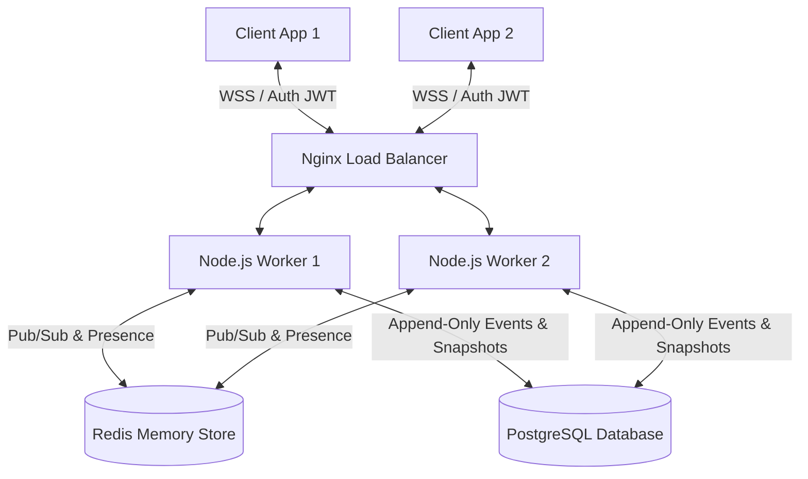

# Real-Time Collaborative Sync Engine

A production-grade, Google Docs-style collaborative editing backend built **from first principles** using the **RGA (Replicated Growable Array) CRDT** algorithm. Designed for high concurrency, fault tolerance, and absolute eventual consistency across distributed replicas.

---

## 🏗️ Architecture



---

## 🚀 Why RGA CRDT (Over OT)?

Unlike Operational Transformation (OT), which requires a complex central coordinator, Replicated Growable Array (RGA) CRDT provides a mathematically sound join-semilattice where convergence is guaranteed natively.

| Feature | Operational Transformation (OT) | **Replicated Growable Array (RGA CRDT)** |
| :--- | :---: | :---: |
| **Horizontal Scaling** | ❌ Requires central sequencer for synchronization | ✅ Any peer merges operations independently |
| **Offline Mode** | ❌ Highly complex conflict resolution logic | ✅ Native offline operation merge matching |
| **Convergence Proof** | ❌ Complex edge cases are difficult to prove | ✅ Formally proven join-semilattice properties |
| **Framework Overhead** | ❌ Heavy dependency on third-party frameworks | ✅ Under 400 lines of custom, zero-dependency code |

---

## 💎 Production Hardening Features

### 1. **Scalable Sequence Allocation**
Replaced the traditional `pg_advisory_xact_lock` and full-table `MAX(seq)` scans with a dedicated `document_sequences` table employing row-level locking. This removes per-document serialization bottlenecks, keeping operation inserts highly performant under massive write concurrency.

### 2. **Tombstone Garbage Collection**
RGA retains tombstoned characters to maintain causal references. We implemented a custom `gc()` method on `RGADocument` that cleans up redundant tombstones from the linked list and index during snapshot intervals, keeping text serialization at O(N) complexity relative to visible text.

### 3. **High-Performance Identity Handshake**
Optimized the JWT refresh token rotation by indexing an 8-character plaintext prefix (`token_prefix`) in PostgreSQL. Instead of conducting an O(N) linear scan calling `bcrypt.compare` on all active tokens, the server fetches matching candidates instantly in O(1).

### 4. **Fail-Safe Replay Protection & Security**
* **Dual-Layer Nonce Verification:** Nonces are validated in Redis via `SETNX` for high-throughput protection. If Redis is unavailable, the guard automatically falls back to PostgreSQL, failing safe (rejecting the operation) if both layers are down.
* **Slow-Loris Guard:** Throttles unauthenticated WebSocket handshakes with a strict limit (`MAX_PENDING_AUTH = 100`) and a 10-second timeout to protect worker threads from socket exhaustion.
* **Global Presence Broadcast:** WebSocket session presence changes are published across workers via Redis Pub/Sub, fanning out client cursor updates cluster-wide.

---

## 🛠️ Quick Start

### 1. Run Core Infrastructure (Docker)
Ensure Docker is installed locally, then launch the PostgreSQL and Redis containers:
```bash
npm run docker:up
```

### 2. Execute Migrations
Run the persistence schema setup script to configure table structures, sequences, and partial indexes:
```bash
npm run migrate
```

### 3. Start Server & Client
```bash
# Start the Sync Engine backend (default port 3000)
npm run dev

# Start the Vite React client (default port 3001)
npm run client
```

* **API Server:** `http://localhost:3000`
* **WebSocket Server:** `ws://localhost:3000/ws`
* **Health Check:** `http://localhost:3000/health`
* **Client App:** `http://localhost:3001`

---

## 🧪 Verification & Testing

Our test suite formally proves convergence under concurrent conflict, out-of-order networks, and database recovery.

```bash
# Run the complete test suite (includes live PG integration tests)
npm test

# Run unit tests only (no database required)
npm run test:unit

# Run E2E concurrent edit simulations
npm run test:e2e
```

### Core Verification Cases Covered:
* **TC-01/02 (Concurrent Inserts):** Asserts convergence by generating all permutations of concurrent inserts at the same position.
* **TC-03/04 (Concurrent Deletes):** Proves commutativity between deletions and concurrent insertions.
* **PBT-01/02 (Property-Based):** Employs `fast-check` to run 200 cycles of randomized multi-site operations, checking convergence mathematically.
* **Database Integration:** Tests `reconstructAtSeq()` and `restoreToRevision()` against the live PostgreSQL instance to verify snapshot compression and delta log replays.

---

## 📁 Repository Map

```
src/
├── shared/          # Shared protocol schema, type models, and constants
├── crdt/            # RGA CRDT logic, Vector Clocks, and Causal buffers
├── server/
│   ├── transport/   # HTTP Server (Express) and WebSocket Server (ws)
│   ├── sync/        # Operation Pipeline, LRU cache, and offline merge matching
│   ├── persistence/ # DB Pool, snapstore, and history rollback logic
│   └── security/    # JWT token signing, Rate Limiting, and Replay Guards
└── client/          # React App workspace and local storage offline queues
```

---

## 📄 License

This project is licensed under the [MIT License](./LICENSE).
